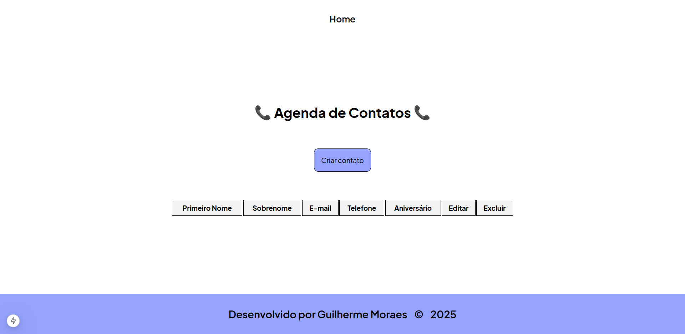
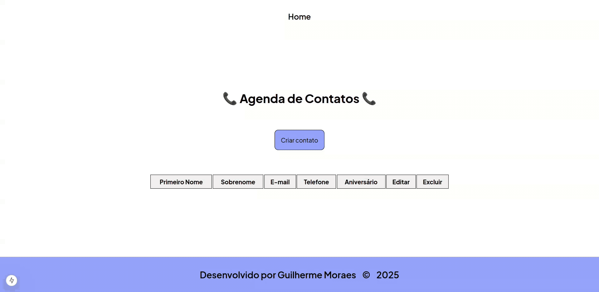
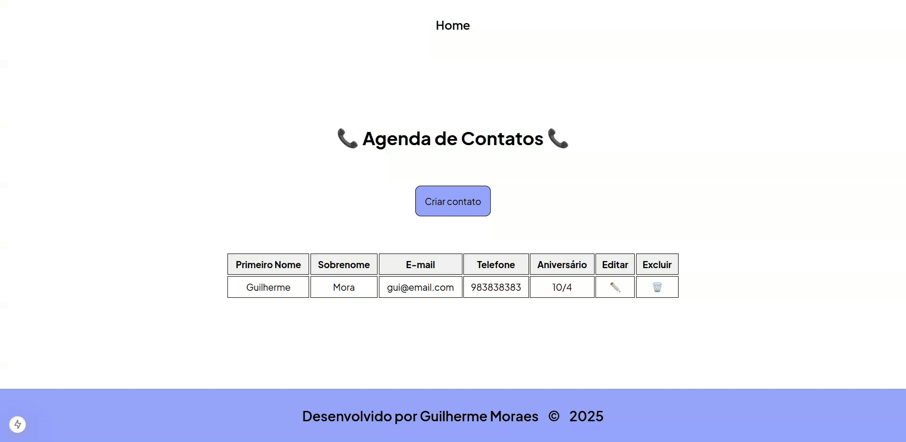
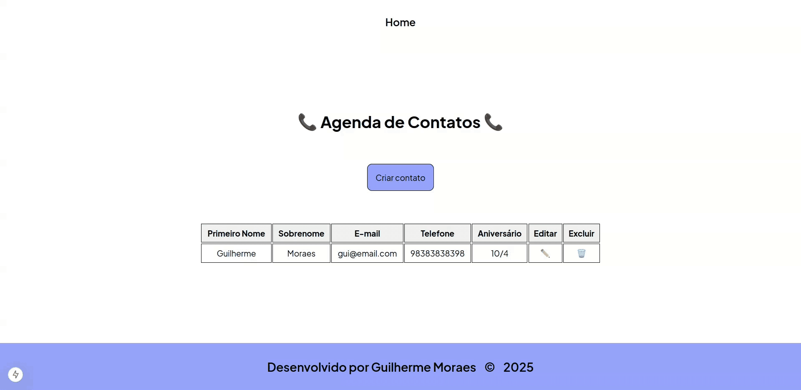

# 📞 Gerenciador de Contatos - Projeto Fullstack

Sistema de Gerenciamento de Contatos criado com Next.js no frontend e Ruby on Rails no backend.

## 🛠️ Tecnologias Utilizadas 

- Front-end: Next.js (React)
- Back-end: Ruby on Rails
- Banco de dados: PostgreSQL + Docker Compose

## ✨ Funcionalidades

- Visualizar contatos



- Criar contatos



- Editar contatos



- Excluir contatos



## ⚙️ Instalação

### 1. Pré-requisitos

- NPM ou Yarn
- Docker
- Ruby (versão: 3.3.7)
- Rails (versão: 8.0.2)

### 2. Configurando o back-end (Ruby on Rails)

Clone o repositório:

```bash
git clone https://github.com/guighm/contact-manager-rails.git

cd contact-manager-rails
```

Instale as dependências:

```bash
bundle install
```

Rode o banco de dados: 

```bash
docker-compose up -d
```

Aplique as migrações:

```bash
rails db:migrate
```

Rode a aplicação:

```bash
rails server
```

### 3. Configurando o front-end (Next.js)

Clone o repositório:

```bash
git clone https://github.com/guighm/contact-manager-react.git
```

Acesse a pasta `contact-manager-react`:

```bash
cd contact-manager-react
```

Instale as dependências:

```bash
npm install 
# ou 
yarn install
```

Crie um arquivo `.env` e copie o seguinte conteúdo nele:

```
NEXT_PUBLIC_API_URL=http://localhost:3000
```

Inicie o front-end:

```bash
npm run dev 
# ou
yarn dev
```

O front-end estará disponível em:

```
http://localhost:3001
```

## 👨‍💻 Autor

<table>
  <tr>
    <td align="center">
    <a href="https://github.com/guighm">
        <br />
        <sub><b>Guilherme Moraes</b></sub>
        </a>
    </td>
  </tr>
</table>